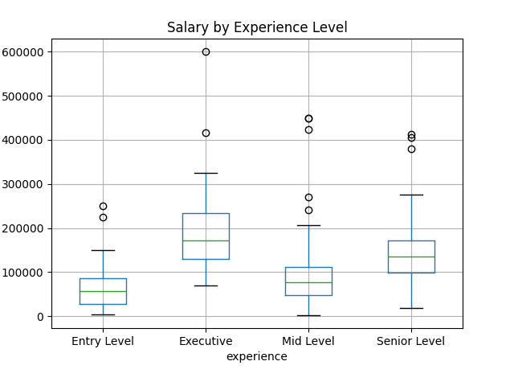
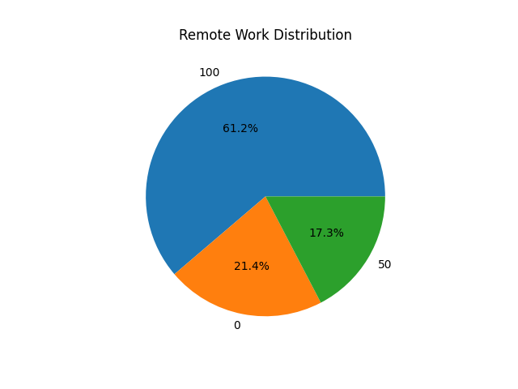
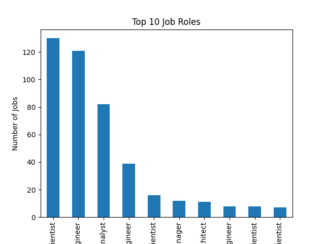
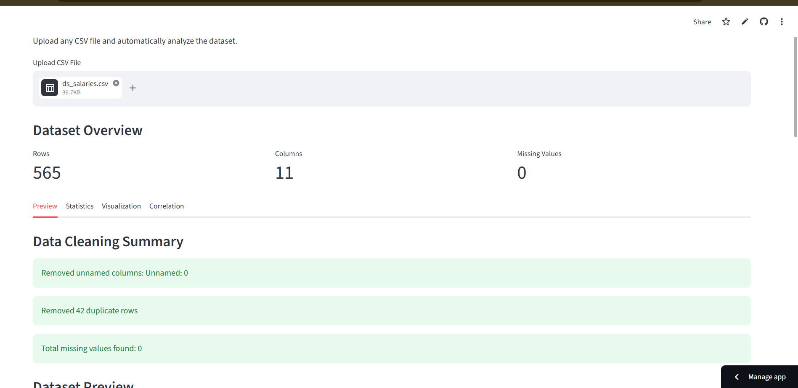

# Job Market Analysis Project

## Live Demo

[Open Streamlit App](https://job-market-analyzer0909.streamlit.app/)

---

## Overview
This project analyzes job market trends using data science techniques.  
The analysis focuses on salary distribution, remote work trends, experience levels, and top job roles in the data industry.

---

## Technologies Used
- Python
- Pandas
- NumPy
- Matplotlib
- Jupyter Notebook

---

## Dataset
The dataset contains job-related information such as:
- Salary
- Experience level
- Remote work ratio
- Company location
- Job titles

---

## Project Structure

```bash
data/          -> Dataset files
notebooks/     -> Jupyter notebooks
visuals/       -> Generated charts and graphs
report/        -> Final project report
```

---

## Visualizations Included
- Salary by Experience Level
- Remote Work Distribution
- Top Job Roles

---

## Key Insights
- Senior-level jobs receive higher salaries.
- Remote work opportunities increased significantly.
- Data Scientist and Data Engineer are among the most demanded roles.

---

## Visualizations

### Salary by Experience Level


### Remote Work Distribution


### Top Job Roles


## Interactive Dashboard

The project also includes a Streamlit-based interactive dashboard where users can:

- Upload CSV datasets
- Perform automatic data analysis
- Detect missing values
- Generate smart visualizations
- View correlation heatmaps
- Download processed datasets

---

## Application Preview




## How to Run

1. Clone the repository
2. Open Jupyter Notebook
3. Run the notebooks inside the `notebooks` folder

---

## Author
Asritha Nalubala
